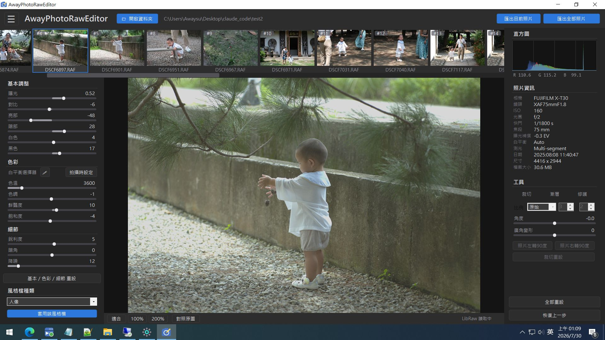
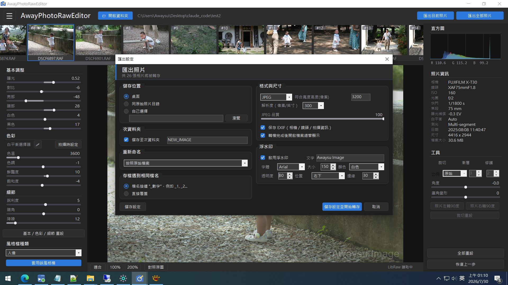
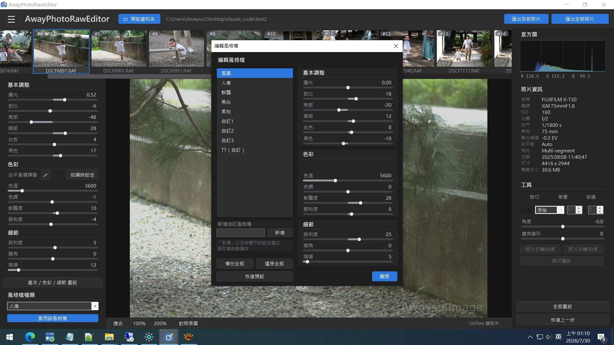

# AwayPhotoRawEditor

AwayPhotoRawEditor 是一套類似 Lightroom 的 Windows RAW 相片編輯器，支援非破壞式編輯、RAW 調色、局部修圖、批次處理、風格檔與完整照片匯出功能。

A lightweight Windows RAW photo editor with non-destructive editing, color adjustment, local retouching, presets, batch processing, and export tools.

所有調整以 XML 存於各資料夾的 `RAW_TEMP` 快取，原始檔案永不變動。

## 畫面 / Screenshots

主畫面（縮圖列、基本／色彩／細節調整、直方圖與 EXIF、裁切／漸層／修護工具）


匯出設定（重新命名規則、尺寸上限、DPI、浮水印、EXIF 保留）


編輯風格檔（內建＋自訂風格檔，可備份／還原）


## 下載

安裝檔請到 [awaysu/Download](https://github.com/awaysu/Download) 下載
`AwayPhotoRawEditor-Setup-vX.Y.Z.exe`（自含式，無需另裝 .NET）。

> 安裝檔以自簽憑證簽署，Windows SmartScreen 可能顯示警告，
> 點「其他資訊 → 仍要執行」即可安裝。安裝為每使用者、不需系統管理員權限。

## 功能

- RAW 解碼（LibRaw）＋一般影像格式（WIC），EXIF 讀取（ExifTool）
- 基本調整／色彩（Kelvin 白平衡、滴管）／細節（銳利度、暗角、降噪）
- 裁切、旋轉、廣角變形、多重線性漸層、局部修護
- 風格檔（內建＋自訂，可編輯覆寫、備份／還原）
- 縮圖多選批次編輯、批次復原、虛擬副本
- 匯出：重新命名規則、尺寸上限、DPI、浮水印、EXIF 保留
- 可切換「經典深色／暖白相紙」兩套自繪 UI
- 八語介面：繁體中文、English、日本語、한국어、简体中文、Deutsch、Français、Español

## 系統需求

- Windows 10 / 11 x64

## 從原始碼建置

```powershell
# .NET 8 SDK
dotnet build src\AwayPhotoRawEditor.csproj -c Debug

# 發佈（自含式）
dotnet publish src\AwayPhotoRawEditor.csproj -c Release -r win-x64 --self-contained true

# 安裝檔（需 Inno Setup 6）
iscc installer\AwayPhotoRawEditor.iss
```

外部工具已內建於 `tools/`（LibRaw 0.22.1、ExifTool 13.59），執行期自動偵測。

## 第三方元件

- [LibRaw](https://www.libraw.org/) 0.22.1 — LGPL 2.1
- [ExifTool](https://exiftool.org/) 13.59 by Phil Harvey — Perl Artistic License

## 作者

Awaysu (awaysu@gmail.com)

## 二次開發 / Modifying this project

歡迎自由修改成你自己的版本，只希望你能在你的「關於」視窗中提及來源是這裡（AwayPhotoRawEditor / Awaysu）。

You are welcome to modify this project into your own version — I only ask that you credit the original source (AwayPhotoRawEditor / Awaysu) in your About dialog.
