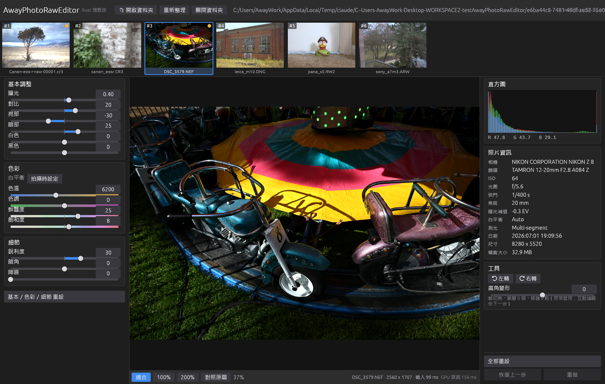

# 第 3 步：egui + wgpu 介面（2026-10-08）

目標：可以實際操作的編輯器視窗——開資料夾 → 縮圖列 → 大圖**直接從 GPU 畫出來** → 滑桿即時更新，
而且和 C#／Swift 版**共用同一個 `RAW_TEMP`**（快取、編輯紀錄互通）。



## 結論

| 項目 | 結果 |
|---|---|
| 三平台可建置、可執行 | ✅ Windows（D3D12）、Linux（RTX 3060 Vulkan，Xvfb 下實際開窗截圖）、macOS（Metal；建置與 shader 驗證通過，SSH 下拿不到視窗畫面，見下） |
| 大圖直接從 GPU 畫（不讀回 CPU） | ✅ 算圖結果的 storage buffer 由 viewer shader 直接畫到視窗；`viewtest` 三平台 × 4 樣本全部通過 |
| `rawpipe.xml` 與 C#／Swift 互通 | ✅ C# 寫的 3 個、Swift 寫的 2 個檔案讀進來再寫回去**逐位元組相同**（含 CRLF／LF、`5200` 不寫成 `5200.0`、`1E-05` 這類 .NET 格式） |
| 讀 C# 版既有的快取與編輯 | ✅ 使用者的 CR3（裁切＋漸層）、NEF（.f16 高精度 proxy＋調整）直接開啟、照常套用；原 XML 未被改動（md5 相同） |
| 相機資訊（EXIF） | ✅ 不再依賴 ExifTool／ImageIO：自寫 TIFF 標籤讀取器＋LibRaw，三平台同一份程式；欄位格式與 Swift 版逐欄比對一致 |
| 第 1、2 步沒有退步 | ✅ hashtest 與 C# 版報告逐字元相同；所有單元測試通過 |

## 做了什麼

- **主畫面**（照 C# 版版面）：上方列 → 縮圖列 → 左欄「基本調整／色彩／細節」→ 中央檢視器＋工具列 → 右欄「直方圖／照片資訊／工具」＋「全部重設／恢復上一步／重做」。深色主題、微軟正黑體 UI（Mac 蘋方、Linux Noto Sans CJK）。
- **檢視器**：適合／100%／200%，左鍵單擊循環縮放（以點擊位置為中心）、拖曳平移、滾輪自由縮放，與 C# `ImageViewer` 相同。**100% = 1 影像像素 : 1 實體螢幕像素**（不受 Windows 150% 縮放影響）；縮小時 shader 做方框平均，不會鋸齒。
- **滑桿**：C# `AdjustmentSlider` 的行為——雙擊回預設、滾輪微調、色溫／色調／飽和度的色帶軌道、雙極滑桿畫中性刻度；右側數值可直接輸入。曝光範圍依處理版本（新版 ±5 EV、舊版 ±2）；非 RAW 的色溫用 ±100 暖冷刻度。
- **其他**：拍攝時白平衡、左右旋轉、廣角變形、對照原圖（`\`）、恢復上一步／重做（Ctrl+Z／Ctrl+Y）、←→ 切換照片、F5 重新整理、Ctrl+O 開資料夾、記住上次的資料夾。
- **縮圖列**：#編號（隱藏的照片佔號，同 C#）、已編輯標記、拉滑桿時目前這張的縮圖 200 ms 後同步更新；縮圖套用調整的規則（相機內嵌預覽的白平衡 rebase）移植自 Swift 版。
- **背景工作**：開資料夾後在背景產生縮圖、proxy、預設 XML（同時 2 張，防 60 MP 檔案吃光記憶體），**不擋操作**——C# 版是先跳進度視窗等全部做完。選到的照片優先載入。
- **直方圖在 GPU 上算**（atomic 計數，結果非同步讀回），只傳回 3 KB；CPU 備援時在 CPU 算。分箱規則同 `ImageStats`。
- **沒有 GPU／GPU 失敗**：自動改走 CPU 算圖，畫面用一般貼圖顯示（`AWPR_NO_GPU=1` 可強制）。

## 架構

| crate | 新增內容 |
|---|---|
| `crates/photo`（新） | `xml`（.NET XmlSerializer 相容讀寫）、`store`（`rawpipe.xml`、`preview_list.xml`）、`paths`（RAW_TEMP 命名、自然排序）、`tiff`（EXIF／可見尺寸）、`exif`、`codec`（JPEG／PNG／TIFF／BMP、`.f16`）、`loader`（縮圖／proxy 快取，移植 `RawLoader.swift`） |
| `crates/gpu` | `GpuPipeline::with_device`（和視窗共用 wgpu 裝置）、`display`（viewer shader，app 與 `viewtest` 共用）、`histogram` |
| `crates/app`（新） | `AwayPhotoRawEditor` 執行檔：`app`（版面與流程）、`viewer`、`widgets`、`worker`（背景工作）、`theme`、`settings` |
| `crates/libraw-sys` / `core` | shim 加 `awpr_read_meta`（相機、鏡頭、ISO…）；`libraw::decode_thumb`、`resize_to_fit` |

**GPU 直接畫的流程**：選照片時 proxy 上傳一次（`upload`）→ 每次拉滑桿 `render` 只送出 compute 指令、不等待 →
同一個 queue 上 egui 的 render pass 接著用 viewer shader 讀那個 buffer 畫到畫面。CPU 全程不碰像素；
GPU 的執行順序由 queue 保證，所以也不需要同步。

## 互通的細節

- **XML 的檔案格式跟著平台的原生版本**：Windows 寫 C# 的樣子（`encoding="utf-8"` 宣告、CRLF、結尾無換行），Mac／Linux 寫 Swift 的樣子。兩種都能讀。
- **設定檔不覆蓋原生版**：第一次啟動讀 C#／Swift 的 `settings.xml` 當初始值，之後只寫自己的 `settings.rust.xml`（同一個資料夾）。原生版的設定欄位比較多，直接覆寫會把它們弄丟。
- **`preview_list.xml` 的路徑**：隱藏清單和虛擬副本存的是寫入那台電腦的絕對路徑；Rust 版用**檔名**比對，所以資料夾搬家或換 OS 開啟仍然有效。
- **RAW 可見尺寸**（C# 用 ExifTool `FullImageSize`、Swift 用 ImageIO）：改從檔案本身讀——RAW 子目錄的 DNG `DefaultCropSize`（Sony ARW 也有寫），沒有的話用 EXIF `PixelXDimension`。7RM6 = 9984×6656、CR3 = 6720×4480、Z8 NEF = 8280×5520、A7M3 = 6000×4000，都和 C#／Swift 記錄的相同。
- **寫到一半的暫存檔**：快取一律先寫 `*.tmp<pid>` 再改名；程式中途結束留下的，下次開資料夾時清掉。

### 和 Swift 版仍有的差異（相機資訊）

| 檔案 | Swift（ImageIO） | Rust | 說明 |
|---|---|---|---|
| Leica M10 DNG | 5952×3968、無光圈 | 5976×3984、f/5.6 | Rust 照 DNG 規格的 `DefaultCropSize`；輸出也因此多 24 px |
| Panasonic S5 RW2 | 6000×4000、鏡頭 LUMIX S 85/F1.8 | 6024×4016、無鏡頭 | RW2 的鏡頭在 makernote；尺寸用 LibRaw 的。要一致得解 Panasonic makernote |
| Canon CR3 | ISO 空白 | ISO 100 | Rust 多讀到 |

## 驗證

### viewer shader：`awpr viewtest`

同一個 shader 畫到離屏貼圖，與「CPU 管線 + CPU 版 shader 取樣」比對。縮放案例畫到 32-bit 浮點貼圖、用 gputest 的標準（8-bit 差≥2 不允許、差 1 ≤ 0.07%）。

| 平台 | 100% | 200% | 50% | 37.12%（非整數、小數偏移） | 浮點最大差 |
|---|---|---|---|---|---|
| Windows · Iris Xe · D3D12 | ✅ | ✅ | ✅ | ✅ | ≤ 5.2e-5 |
| macOS · M2 · Metal | ✅ | ✅ | ✅ | ✅ | ≤ 6.3e-5 |
| Linux · RTX 3060 · Vulkan | ✅ | ✅ | ✅ | ✅ | ≤ 6.9e-5 |

（4 個樣本 × 每格，報告在 `tests/results/view/`。）另外兩個參考案例看 **GPU 硬體自己輸出 8-bit** 時多出來的差：
全部最大差 1、沒有差 2；差 1 的比例 Apple 0.01–0.05%、Intel 0.1–0.4%、NVIDIA 約 3%（各家 float→8-bit 的捨入不同）；
sRGB 目標 2–8%（只在視窗沒有一般 8-bit 格式時才會用到；三個平台實際拿到的都是 `Bgra8Unorm`）。

### 畫面截圖

- Windows：同一張照片 100% 檢視，GPU 直接畫與 CPU 算圖後貼圖顯示的**螢幕截圖逐像素比較**：最大差 1、沒有差 2（差 1 0.14%）。
- Linux：Xvfb 虛擬顯示器下用 RTX 3060（Vulkan）正常開窗、算圖、截圖（`docs/images/step3-linux-rtx3060.png`）。
- macOS：SSH 啟動的程式有在跑（每個 frame 都有算圖），但拿不到視窗畫面——遠端登入的 session 看不到使用者的桌面（螢幕休眠或不在前景時 macOS 不出畫面）。Metal 的顯示路徑由 `viewtest` 驗證。**請在 Mac mini 前面實際開一次確認。**

## 指令

```bash
cargo build --release                              # 需要 Rust 1.95 以上（egui 0.36）
target/release/AwayPhotoRawEditor                  # 開上次的資料夾
target/release/AwayPhotoRawEditor --shot <資料夾> <out.png> [WxH] [第幾張]   # 截圖後結束（不寫設定、不存編輯）
AWPR_SHOT_ADJ="exposure=0.5,contrast=20" AWPR_SHOT_ZOOM=100 …               # 截圖時套用的調整／縮放
AWPR_NO_GPU=1 …                                    # 強制 CPU 算圖
AWPR_TRACE=<檔案> …                                # 執行軌跡（正式版沒有主控台）
cargo build --release -p awpr-app --features console   # Windows 正式版保留主控台視窗
awpr viewtest <raw> [report]                       # viewer shader 對照
awpr meta <檔案>                                   # 照片資訊各欄位（= rawpipe.xml 的 Exif）
```

## 還沒做（下一步）

照 C# 版的功能清單，第 3 步做的是「看」和「調」的主幹；以下還沒有：

1. **工具的互動編輯**：裁切框、線性漸層手把、修護圓圈（XML 裡已有的照常套用）、白平衡滴管。
2. **匯出**（含 16-bit TIFF／PNG＋ICC——比較頁的建議第 5 項）、浮水印。
3. **風格檔**、多選批次同步、虛擬副本建立、隱藏／刪除照片、複製貼上設定。
4. **設定視窗、8 種語言、字體大小、關於／檢查更新**。
5. **HEIC**：需要 libheif（LGPL，動態連結）。三台建置機目前都沒有裝，要先決定是否由程式附帶。
6. 開資料夾時要不要像 C# 一樣先跳進度視窗等快取全部做完（目前是背景產生、可以直接操作）。

## 踩到的坑

- egui 0.36 需要 rustc ≥ 1.95：Windows 的 Rust 從 1.94 更新到 1.99（Linux、Mac 本來就是 1.99）。
- Windows 正式版沒有主控台，panic 看不到：加了 `%TEMP%\awpr_crash.txt` 當機紀錄與 `AWPR_TRACE`。
- quick-xml 0.38 起，`&amp;` 這類實體不再併在文字事件裡（另外給 `GeneralRef` 事件），要自己接回去。
- .NET 的 double 從 `1E-05` 開始用科學記號（`0.0001` 仍是一般寫法），不是 Rust 的規則。
- RW2 內嵌 JPEG 的 EXIF 有完整的白平衡等欄位，但 `PixelXDimension` 是預覽圖的 1920，不能拿來當照片尺寸。
